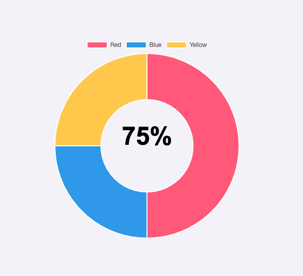

# Centered Text in Chart.js Donut Chart

This guide explains how to add and center text inside a Chart.js donut chart using a custom plugin.

## Quick Start

```javascript
// Complete working example
const chart = new Chart(ctx, {
  type: "doughnut",
  data: {
    // ... your data
  },
  options: {
    plugins: {
      customText: {
        text: "75%",
      },
    },
  },
});
```

## How It Works

### 1. Plugin Registration

First, we create and register a custom plugin that will handle drawing the centered text:

```javascript
const centerTextPlugin = {
  id: "customText",
  beforeDraw(chart, args, options) {
    // Plugin code here
  },
};
Chart.register(centerTextPlugin);
```

### 2. Plugin Configuration

In the chart options, we specify the text we want to display:

```javascript
const options = {
  plugins: {
    customText: {
      text: "75%",
    },
  },
};
```

### 3. Text Centering Process - Step by Step

#### Step 1: Get Chart Dimensions

```javascript
const { ctx, width, height } = chart;
```

This gives us:

- `ctx`: The canvas context for drawing
- `width`: Total chart width
- `height`: Total chart height

#### Step 2: Calculate Responsive Font Size

```javascript
const fontSize = Math.min(width, height) / 8;
```

- Takes the smaller dimension (width or height)
- Divides by 8 to create proportional text size
- Ensures text remains readable at any chart size

#### Step 3: Save Canvas State

```javascript
ctx.save();
```

- Preserves the current canvas settings
- Prevents our text styling from affecting other chart elements

#### Step 4: Configure Text Properties

```javascript
ctx.textAlign = "center";
ctx.textBaseline = "middle";
ctx.font = `bold ${fontSize}px Arial`;
ctx.fillStyle = "black";
```

- `textAlign: "center"`: Makes the text center around its x position
- `textBaseline: "middle"`: Makes the text center around its y position
- Sets font size, weight, and color

#### Step 5: Calculate Center Coordinates

```javascript
const centerX = width / 2;
const centerY = height / 2;
```

- Finds the exact middle point of the chart
- These coordinates will be our text anchor point

#### Step 6: Draw the Text

```javascript
ctx.fillText(text, centerX, centerY);
ctx.restore();
```

- Places the text at the calculated center point
- Text will be perfectly centered both horizontally and vertically

#### Step 7: Restore Canvas State

```javascript
ctx.restore();
```

- Returns canvas to its original state
- Ensures clean slate for next render

### 4. Container Centering

The chart container itself is centered using CSS Flexbox:

```html
<div
  style="display: flex; justify-content: center; align-items: center; height: 100vh;"
>
  <canvas id="myChart" width="400" height="400"></canvas>
</div>
```

CSS Properties Explained:

- `width/height`: Fixed dimensions for the container
- `margin: 0 auto`: Centers the container horizontally
- `display: flex`: Enables flexbox layout
- `justify-content: center`: Centers horizontally within flex container
- `align-items: center`: Centers vertically within flex container

## Final Result

The combination of these steps creates:

1. A perfectly centered donut chart in the page
2. Text that's precisely centered within the donut
3. Responsive sizing that maintains proportions
4. Clean integration with Chart.js's existing features



## Tips

- Always use `ctx.save()` and `ctx.restore()` to maintain canvas state
- Test the chart at different sizes to ensure responsive behavior
- Consider adjusting the font size divisor (8) based on your specific needs
